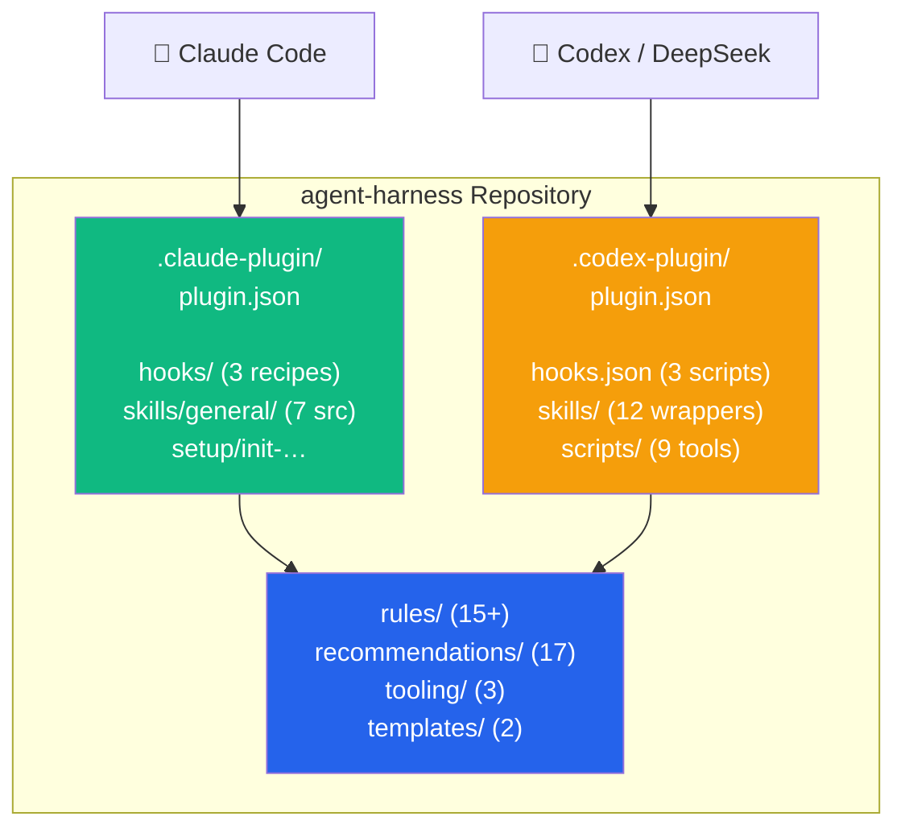

# agent-harness

> Multi-agent development harness: **workflow rules, reusable skills, hooks, plugin configuration, tooling preferences, and project templates** for Claude Code and Codex. Install once, then scaffold any new project with the relevant subset — regardless of which agent you use.

> **Language:** English | [中文](README.zh.md)

[](LICENSE) [](https://github.com/jajupmochi/agent-harness) [](https://github.com/jajupmochi/agent-harness/actions/workflows/privacy-scan.yml) [](https://github.com/jajupmochi/agent-harness/actions/workflows/install-verify.yml)

## Master TOC

- [What this is](#what-this-is)
- [Quick Start](#quick-start)
- [Repository structure](#repository-structure)
- [Workflow rules (15+)](#workflow-rules-15)
- [Reusable skills (13)](#reusable-skills-13)
- [Hooks (6: 3 Claude + 3 Codex)](#hooks-6-3-claude--3-codex)
- [Recommendations (17 lists)](#recommendations-17-lists)
- [Project templates](#project-templates)
- [Setup skills](#setup-skills)
- [Multi-agent architecture](#multi-agent-architecture)
- [Commit discipline](#commit-discipline)
- [For maintainers](#for-maintainers)
- [Build history](#build-history)
- [Contributing](#contributing)
- [License](#license)

## What this is

AI agent usage conventions accumulated since early 2026 — rules, hooks, skills, tool recommendations, and project templates extracted from half a dozen real research and web projects. Packaged as **one library, two agent entrypoints**:

| Agent | Plugin manifest | Skills | Hooks | Setup skill |
|---|---|---|---|---|
| **Claude Code** | `.claude-plugin/plugin.json` | `skills/general/*` (7 source skills) | `hooks/*` (3 recipes) | `/init-agent-config` |
| **Codex** | `.codex-plugin/plugin.json` | `skills/*` (13 wrapper skills) | `hooks.json` (3 scripts) | `/skills` → `init-codex-config` |
| **Other agents** | Via `agent-config-adapter` skill | See adapter workflow | See adapter workflow | — |

**Four aims:**

1. **One source of truth.** Same rules/skills/hooks, separate agent entrypoints — no duplication, no drift.
2. **Per-project picking.** The setup skill asks context tags (`research-pkg`, `ui-project`, `static-site`, etc.) and only installs the matching subset.
3. **Human-readable.** Each rule, hook, and skill explains *why* it exists. Non-AI readers still get value.
4. **Model-agnostic.** Codex wrapper skills map Claude-specific tool names to Codex equivalents. Non-vision models (DeepSeek) use screenshot-based visual verification. Auto-loading (`allow_implicit_invocation`) replaces manual skill invocation where appropriate.

## Quick Start

### Claude Code

```bash
# One-liner install
npx github:jajupmochi/agent-harness

# Or local clone
git clone https://github.com/jajupmochi/agent-harness.git ~/.claude/agent-harness
cd /path/to/your-project
claude
/init-agent-config   # answer 6 questions → project scaffolded
```

### Codex

```bash
git clone https://github.com/jajupmochi/agent-harness.git ~/agent-harness
cd ~/agent-harness
npm run verify:codex   # structural checks pass before install
npm run activate:codex  # symlinks skills → ~/.agents/skills, creates marketplace entry

# Restart Codex → /skills shows agent-harness skills
# Use /plugins to inspect the local plugin entry
```

**6 Claude install methods** in **[USAGE.md §0](USAGE.md#0-install-agent-harness-once-per-machine)**.

## Repository structure

```
agent-harness/
├── README.md / README.zh.md              ← you are here
├── USAGE.md / USAGE.zh.md                ← step-by-step walkthroughs
├── INVENTORY.md / .zh.md                 ← master index of catalogued items
├── CLAUDE.md                             ← rules for editing the lib itself
├── LICENSE                               ← MIT
├── package.json                          ← npm metadata, install/verify/update scripts
│
├── .claude-plugin/plugin.json            ← Claude Code plugin manifest
├── .codex-plugin/plugin.json             ← Codex plugin manifest
├── hooks.json                            ← Codex-bundled hooks (ruff, jq, review-gate)
│
├── rules/                                ← 15+ workflow rules
│   ├── commit-discipline/                ← conventional commit enforcement
│   ├── chinese-output/                   ← and 14 more …
│   └── <rule-name>/RULE.md + snippet.md
│
├── skills/                               ← 13 wrapper skills for Codex + source catalog
│   ├── general/                          ← 7 Claude source skills
│   ├── init-codex-config/                ← Codex setup skill
│   ├── agent-config-adapter/             ← cross-agent migration workflow
│   ├── code-verifier/                    ← auto-loading code audit (allow_implicit_invocation)
│   ├── research-critic/                  ← auto-loading research critique
│   ├── verify-visual/                    ← screenshot-based (works with non-vision models)
│   ├── verify-template/ preview-template/ long-running-tasks/ privacy-redact/
│   ├── system-cleanup/ autoresearch-toolfinder/
│   └── general/SKILL.md                  ← source catalog index
│
├── hooks/                                ← 3 Claude Code hook recipes
│   ├── ruff-format-on-edit/              ← auto-format Python on Write|Edit
│   ├── jq-validate-json/                 ← block invalid JSON in data files
│   └── review-gate/                      ← Stop-event audit of uncommitted changes
│
├── scripts/                              ← Codex hook scripts + installer/verifier
│   ├── codex_review_gate.sh              ← Stop hook: audit git state
│   ├── codex_visual_verify.sh            ← Screenshot capture (non-vision safe)
│   ├── codex_ruff_format_on_edit.sh      ← PostToolUse: format Python
│   ├── codex_jq_validate_json.sh         ← PostToolUse: validate JSON
│   ├── codex_commit_msg.sh               ← commit-msg hook (conventional commits)
│   ├── install-codex-local.js            ← local Codex skill/plugin installer
│   ├── verify-codex-adapter.js           ← structural validation
│   └── codex-update-safe.js              ← safe Codex CLI updater
│
├── recommendations/                      ← 17 curated lists (plugins, tools, frameworks)
├── tooling/                              ← 3 toolchain preferences
├── templates/                            ← 2 project starters
├── setup/                                ← Claude setup skill
├── docs/                                 ← philosophy, consumption modes, contributing
│   ├── PHILOSOPHY.md / .zh.md
│   ├── CONSUMPTION.md / .zh.md
│   ├── CONTRIBUTING.md
│   └── CODEX_ADAPTATION_PLAN.md          ← architecture and research notes
└── .claude/                              ← meta-skills for editing the lib itself
```

## Workflow rules (15+)

Each ships as `RULE.md` (full content, rationale, examples, exceptions) + `snippet.md` (drop-in excerpt).

| Rule | Scope | When applies |
|---|---|---|
| [`pre-edit-confirmation`](rules/pre-edit-confirmation/RULE.md) | universal | List targets + plan + wait for explicit "go" before any Edit/Write |
| [`phased-planning`](rules/phased-planning/RULE.md) | universal | Tasks touching 3+ files / >5 tool calls → numbered phases with pause |
| [`plugin-preflight`](rules/plugin-preflight/RULE.md) | universal | Verify plugin/skill/command installed before invoking |
| [`ui-iteration-loop`](rules/ui-iteration-loop/RULE.md) | ui-project | Visual reference → 8-iteration loop with screenshots + self-critique |
| [`output-brevity`](rules/output-brevity/RULE.md) | personal | No end-of-batch recap, skip tool output echo, prefer Edit over Write |
| [`tool-proactivity`](rules/tool-proactivity/RULE.md) | personal | Installed plugin/skill/MCP fires without asking (explicit-approval exceptions) |
| [`no-reread-files`](rules/no-reread-files/RULE.md) | personal | Trust in-session memory; re-read only on actual change |
| [`chinese-output`](rules/chinese-output/RULE.md) | personal | Final user-facing output in Chinese; intermediate stays English |
| [`bilingual-docs`](rules/bilingual-docs/RULE.md) | optional | `NAME.md` + `NAME.zh.md` convention for human-facing docs |
| [`commit-discipline`](rules/commit-discipline/RULE.md) | always | Every commit MUST follow conventional commit format; install `.git/hooks/commit-msg` |
| [`end-of-turn-marker`](rules/end-of-turn-marker/RULE.md) | personal | End every turn with `[END:FINAL]` / `[END:WAIT]` / `[END:NEEDS_USER]` |
| [`always-on-verification`](rules/always-on-verification/RULE.md) | research-pkg | Auto-invoke `code-verifier` + `research-critic` before any results claim |
| [`autorun-mode`](rules/autorun-mode/RULE.md) | personal | Higher-autonomy cadence + multi-pass review + branch hygiene |
| [`multi-round-redesign`](rules/multi-round-redesign/RULE.md) | ui-project | N-round UI redesign with date-stamped outputs + discipline |
| [`latex-edit-policy`](rules/latex-edit-policy/RULE.md) | research-pkg | Hard fixes direct; content edits comment-don't-delete |

## Reusable skills (13)

13 skills appear in Codex `/skills`. Claude Code uses 7 source skills under `skills/general/`. Codex wrappers auto-load where configured.

| Skill | Auto-load | Purpose |
|---|---|---|
| [`init-codex-config`](skills/init-codex-config/SKILL.md) | — | Scaffold Codex project with AGENTS.md, .codex/hooks.json, .agents/skills |
| [`agent-config-adapter`](skills/agent-config-adapter/SKILL.md) | — | Port agent configuration between Claude Code, Codex, Gemini, or non-native models |
| [`code-verifier`](skills/code-verifier/SKILL.md) | ✅ implicit | Audit code/tests/results before success claims — detects fake-run patterns |
| [`research-critic`](skills/research-critic/SKILL.md) | ✅ implicit | Six-question audit: falsifiability, design, comparison, leakage, conclusion, alternatives |
| [`verify-visual`](skills/verify-visual/SKILL.md) | — | Screenshot-based UI verification. Works with non-vision models (DeepSeek): captures screenshots, returns paths, no AI vision needed |
| [`verify-template`](skills/verify-template/SKILL.md) | — | Run CI gates locally (ruff + mypy + pytest); customize per project |
| [`preview-template`](skills/preview-template/SKILL.md) | — | Start local dev server (HTTP, Vite, Next.js, MkDocs, Storybook) |
| [`long-running-tasks`](skills/long-running-tasks/SKILL.md) | — | Codex: exec_command sessions + write_stdin polling. Claude: background Bash + Monitor |
| [`privacy-redact`](skills/privacy-redact/SKILL.md) | — | Scan for usernames, paths, tokens, codenames; redact with placeholders |
| [`system-cleanup`](skills/system-cleanup/SKILL.md) | — | Free disk space: uv cache, huggingface, JetBrains, Docker, pip |
| [`autoresearch-toolfinder`](skills/autoresearch-toolfinder/SKILL.md) | — | Discover ML research tools (auto-install, weekly timer) |
| [`figma-design-fetch`](skills/figma-design-fetch/SKILL.md) | — | Figma design-to-code via the official MCP: OAuth connect, fetch code/assets/screenshot to a gitignored `.design-imports/`, rebuild with existing components; encodes 6 tested gotchas. Ships `/figma-fetch` |
| [`general`](skills/general/SKILL.md) | — | Source catalog index — maps Claude source skills to Codex wrappers |

## Hooks (6: 3 Claude + 3 Codex)

All hooks have both Claude Code and Codex implementations.

| Hook | Agent | Event | What it does |
|---|---|---|---|
| **ruff format** | Claude | PostToolUse (Write|Edit) | Auto-format `*.py` with ruff |
| | Codex | PostToolUse (Edit|Write|apply_patch) | Same — runs `ruff format` + `ruff check --fix` |
| **jq validate** | Claude | PostToolUse (Write|Edit) | Block if invalid JSON written to `*/locales/*` or `*/data/*` |
| | Codex | PostToolUse (Edit|Write|apply_patch) | Same — emits `decision: "block"` on invalid JSON |
| **review-gate** | Claude | Stop | Audit uncommitted changes at session end, warn if on protected branch |
| | Codex | Stop | Same — checks git status, recent destructive ops, protected branches, always emits summary |

**How review-gate works:** On session end (Stop event), the hook checks for uncommitted changes, recent destructive git operations, and whether you're on a protected branch. It always emits a status message — even when clean. This ensures you never end a session without knowing what's pending.

## Recommendations (17 lists)

Each list has agent-executable install commands and context tags. Lists reference both Claude Code plugins and general-purpose tools appropriate for any agent.

| File | Context | Coverage |
|---|---|---|
| [cc-plugins.md](recommendations/cc-plugins.md) | always | 37 Claude Code plugins (workflow, integrations, specialized) |
| [cc-marketplaces-and-skill-bundles.md](recommendations/cc-marketplaces-and-skill-bundles.md) | always | 4 third-party marketplaces + 9 skill bundles |
| [cli-tools.md](recommendations/cli-tools.md) | always | System CLIs (jq, gh, ripgrep, fd, …) + Python user CLIs |
| [js-ui-and-design.md](recommendations/js-ui-and-design.md) | ui-project | Lucide, Radix, Chakra UI, lenis, d3, visx, monaco, shadcn |
| [js-animation-and-3d.md](recommendations/js-animation-and-3d.md) | 3d-or-animation | motion, gsap, anime.js, lottie, three, R3F, mediapipe |
| [js-build-test-style.md](recommendations/js-build-test-style.md) | ui-project | vite, next, electron, vitest, playwright, storybook, tailwindcss |
| [js-state-data.md](recommendations/js-state-data.md) | ui-project | pinia, zustand, swr, vueuse, vue-i18n, vue-router |
| [web-auditing.md](recommendations/web-auditing.md) | static-site / web-perf | chrome-devtools MCP, lighthouse, pa11y, axe-core |
| [image-video-pdf.md](recommendations/image-video-pdf.md) | image-or-video-work | sharp, svgo, ffmpeg, puppeteer |
| [docs-tools.md](recommendations/docs-tools.md) | docs-site | mkdocs + material, ghp-import, latexmk |
| [ml-research.md](recommendations/ml-research.md) | ml-research | huggingface_hub, datasets, gpustat, MLflow, W&B, ClearML |
| [orchestra-ml-skills.md](recommendations/orchestra-ml-skills.md) | ml-research | 21-category ML skill stack with meta-orchestrator |
| [ai-coding-tools.md](recommendations/ai-coding-tools.md) | optional | OpenSpec, paperreview.ai |
| [cluster-hpc.md](recommendations/cluster-hpc.md) | optional | SLURM patterns, free-tier rules, rsync conventions |
| [reference-projects.md](recommendations/reference-projects.md) | optional | Standalone demos / template projects |
| [reference/apt-packages.md](recommendations/reference/apt-packages.md) | lookup | Apt packages — never auto-install |
| [reference/vscode-extensions.md](recommendations/reference/vscode-extensions.md) | lookup | VS Code extensions — never auto-install |

## Project templates

Minimal-but-complete starters.

| Template | Type | Claude | Codex |
|---|---|---|---|
| [research-package-py/](templates/research-package-py/TEMPLATE_README.md) | Python research | CLAUDE.md + pyproject.toml + ruff hook | init-codex-config translates → AGENTS.md + .codex/hooks.json |
| [personal-cite-static/](templates/personal-cite-static/TEMPLATE_README.md) | Static site (i18n) | CLAUDE.md + index.html + locales + jq hook | init-codex-config translates → Codex equivalents |

## Setup skills

| Skill | Agent | Trigger | What it does |
|---|---|---|---|
| [`init-agent-config`](setup/init-agent-config/SKILL.md) | Claude Code | `/init-agent-config` | Detect project type → ask 6 questions → compose CLAUDE.md, hooks, skills |
| [`init-codex-config`](skills/init-codex-config/SKILL.md) | Codex | `/skills` → `init-codex-config` | Same workflow, emits AGENTS.md, .codex/hooks.json, .agents/skills |
| [`agent-config-adapter`](skills/agent-config-adapter/SKILL.md) | Any | `/skills` → `agent-config-adapter` | Map source agent config to target agent + model route |

## Multi-agent architecture



**Design principle:** Shared rules, recommendations, tooling, and templates live once. Agent-specific entrypoints (manifests, hooks, setup skills) isolate agent differences. Codex wrappers map Claude Code tool names to Codex equivalents without modifying the original Claude skill bodies.

**Non-vision model support:** The `verify-visual` Codex skill uses screenshot capture instead of AI vision analysis. It screenshots at specified viewports using Playwright or headless Chrome, saves to date-stamped directories, and returns file paths. This works with DeepSeek and any other model lacking native vision capabilities. Compare screenshots pixel-by-pixel with reference images for regression detection.

## Commit discipline

The `commit-discipline` rule and `.git/hooks/commit-msg` hook enforce conventional commit format. This is especially important for non-native models (DeepSeek) that tend to skip or write lazy commit messages.

```bash
# Install the hook (one-time per repo)
cp scripts/codex_commit_msg.sh .git/hooks/commit-msg
```

Format: `type[(scope)]: description`. Valid types: feat fix docs style refactor perf test chore ci build revert.

## For maintainers

Four meta-skills under `.claude/skills/`:

| Meta-skill | Purpose |
|---|---|
| `/new-rule` | Scaffold a new workflow rule with frontmatter + RULE.md + snippet.md |
| `/new-skill` | Scaffold a new skill (Claude source + Codex wrapper) |
| `/new-hook` | Scaffold a new hook recipe (8-step: dedup → pipe-test → wrap → validate → live-proof → cleanup → handoff) |
| `/publish` | Tag SemVer + push + GitHub release |

See [`docs/CONTRIBUTING.md`](docs/CONTRIBUTING.md) for formal specs, inventory-sync rules, and bilingual conventions.

## Build history

| Phase | Date | Focus |
|---|---|---|
| P1–P2 | 2026-04-29 | Foundation + 9 rules |
| P3 | 2026-04-29 | 2 hooks (ruff, jq) |
| P4 | 2026-04-29 | 5 skills (verify, preview, long-running, verify-visual, privacy-redact) |
| P5 | 2026-04-29 | 12 recommendation lists |
| P6 | 2026-04-29 | 3 tooling categories |
| P7 | 2026-04-29 | 2 project templates |
| P8 | 2026-04-29 | setup skill |
| P9 | 2026-04-29 | LICENSE + meta-skills + publish |
| P10 | 2026-05 | Plugin packaging, additional rules (writing-style, end-of-turn-marker, etc.) |
| P11 | 2026-07-08 | Codex adapter: .codex-plugin, 12 wrapper skills, hooks.json, install/verify/update scripts |
| P12 | 2026-07-08 | Multi-agent rename (agent-harness), review-gate Stop hook, visual-verify for non-vision models, code-verifier auto-load, commit discipline enforcement |

**Total surface:** 15+ rules + 13 skills + 6 hooks (dual-agent) + 17 recommendation lists + 3 tooling templates + 2 project templates + 2 setup skills + 8 scripts + bilingual docs + 2 plugin manifests.

## Contributing

PRs welcome. Open an issue first. See [`docs/CONTRIBUTING.md`](docs/CONTRIBUTING.md).

## License

MIT — see [LICENSE](LICENSE).
