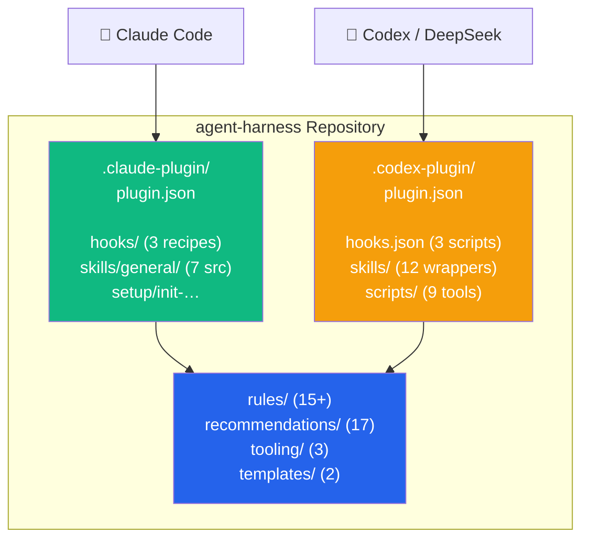

# agent-harness

> 多 Agent 开发工具链：**工作流规则、可复用技能、钩子、插件配置、工具偏好和项目模板**，同时支持 Claude Code 与 Codex。装一次，在任何新项目中按需 scaffold——无论你使用哪个 Agent。

> **语言：** [English](README.md) | 中文

[](LICENSE) [](https://github.com/jajupmochi/agent-harness) [](https://github.com/jajupmochi/agent-harness/actions/workflows/privacy-scan.yml) [](https://github.com/jajupmochi/agent-harness/actions/workflows/install-verify.yml)

## Master TOC

- [这是什么](#这是什么)
- [快速上手](#快速上手)
- [仓库结构](#仓库结构)
- [工作流规则（15+）](#工作流规则15)
- [可复用技能（12）](#可复用技能12)
- [钩子（6：3 Claude + 3 Codex）](#钩子63-claude--3-codex)
- [推荐清单（17 类）](#推荐清单17-类)
- [项目模板](#项目模板)
- [安装技能](#安装技能)
- [多 Agent 架构](#多-agent-架构)
- [提交规范](#提交规范)
- [给维护者](#给维护者)
- [构建历程](#构建历程)
- [贡献](#贡献)
- [许可](#许可)

## 这是什么

自 2026 年初积累的 AI Agent 使用约定——规则、钩子、技能、工具推荐和项目模板，从六七个真实研究/Web 项目（`liulian-python`、`swiss-river-network-benchmark`、`AI_Mur4Cast`、`jajupmochi.github.io` 加数个前端）中抽取，打包成**一个库，两套 Agent 入口**：

| Agent | 插件 manifest | 技能 | 钩子 | 安装技能 |
|---|---|---|---|---|
| **Claude Code** | `.claude-plugin/plugin.json` | `skills/general/*`（7 个源技能） | `hooks/*`（3 个配方） | `/init-agent-config` |
| **Codex** | `.codex-plugin/plugin.json` | `skills/*`（12 个包装技能） | `hooks.json`（3 个脚本） | `/skills` → `init-codex-config` |
| **其他 Agent** | 通过 `agent-config-adapter` 技能 | 见适配工作流 | 见适配工作流 | — |

**四个目标：**

1. **唯一权威。** 同一套规则/技能/钩子，不同 Agent 入口——不重复、不漂移。
2. **按需选取。** 安装技能询问项目类型和 context 标签（`research-pkg`、`ui-project`、`static-site` 等），只装匹配子集。
3. **人类可读。** 每条规则、钩子、技能都解释*为什么*存在。不用 AI 也能看懂。
4. **模型无关。** Codex 包装技能把 Claude 专用工具名映射为 Codex 等价名。非视觉模型（DeepSeek）用截图式视觉验证。支持自动加载（`allow_implicit_invocation`），减少手动技能调用。

## 快速上手

### Claude Code

```bash
# 一行安装
npx github:jajupmochi/agent-harness

# 或本地 clone
git clone https://github.com/jajupmochi/agent-harness.git ~/.claude/agent-harness
cd /path/to/your-project
claude
/init-agent-config   # 回答 6 个问题 → 项目 scaffold 完成
```

### Codex

```bash
git clone https://github.com/jajupmochi/agent-harness.git ~/agent-harness
cd ~/agent-harness
npm run verify:codex   # 结构验证通过后再安装
npm run activate:codex  # 软链技能 → ~/.agents/skills，创建 marketplace 条目

# 重启 Codex → /skills 显示 agent-harness 技能
# 用 /plugins 查看本地插件条目
```

**Claude 6 种安装方式**详见 **[USAGE.zh.md §0](USAGE.zh.md#0-安装-agent-harness每台机器一次)**。

## 仓库结构

```
agent-harness/
├── README.md / README.zh.md              ← 你在这里
├── USAGE.md / USAGE.zh.md                ← 分步操作指南
├── INVENTORY.md / .zh.md                 ← 已收录条目的主索引
├── CLAUDE.md                             ← 编辑库本身的规则
├── LICENSE                               ← MIT
├── package.json                          ← npm 元数据，安装/验证/更新脚本
│
├── .claude-plugin/plugin.json            ← Claude Code 插件 manifest
├── .codex-plugin/plugin.json             ← Codex 插件 manifest
├── hooks.json                            ← Codex 内置钩子（ruff、jq、review-gate）
│
├── rules/                                ← 15+ 条工作流规则
│   ├── commit-discipline/                ← 约定式提交强制执行
│   ├── chinese-output/                   ← 以及另外 14 条…
│   └── <规则名>/RULE.md + snippet.md
│
├── skills/                               ← Codex 12 个包装技能 + 源目录
│   ├── general/                          ← 7 个 Claude 源技能
│   ├── init-codex-config/                ← Codex 安装技能
│   ├── agent-config-adapter/             ← 跨 Agent 迁移工作流
│   ├── code-verifier/                    ← 自动加载代码审计
│   ├── research-critic/                  ← 自动加载研究批判
│   ├── verify-visual/                    ← 截图式（兼容非视觉模型）
│   ├── verify-template/ preview-template/ long-running-tasks/ privacy-redact/
│   ├── system-cleanup/ autoresearch-toolfinder/
│   └── general/SKILL.md                  ← 源目录索引
│
├── hooks/                                ← 3 个 Claude Code 钩子配方
│   ├── ruff-format-on-edit/              ← Write|Edit 时自动格式化 Python
│   ├── jq-validate-json/                 ← 阻止无效 JSON 写入数据文件
│   └── review-gate/                      ← Stop 事件审计未提交变更
│
├── scripts/                              ← Codex 钩子脚本 + 安装/验证器
│   ├── codex_review_gate.sh              ← Stop 钩子：审计 git 状态
│   ├── codex_visual_verify.sh            ← 截图捕获（非视觉模型安全）
│   ├── codex_ruff_format_on_edit.sh      ← PostToolUse：格式化 Python
│   ├── codex_jq_validate_json.sh         ← PostToolUse：校验 JSON
│   ├── codex_commit_msg.sh               ← commit-msg 钩子（约定式提交）
│   ├── install-codex-local.js            ← 本地 Codex 安装器
│   ├── verify-codex-adapter.js           ← 结构验证
│   └── codex-update-safe.js              ← 安全的 Codex CLI 更新器
│
├── recommendations/                      ← 17 类推荐清单（插件、工具、框架）
├── tooling/                              ← 3 类工具偏好
├── templates/                            ← 2 个项目启动模板
├── setup/                                ← Claude 安装技能
├── docs/                                 ← 理念、消费模式、贡献指南
│   ├── PHILOSOPHY.md / .zh.md
│   ├── CONSUMPTION.md / .zh.md
│   ├── CONTRIBUTING.md
│   └── CODEX_ADAPTATION_PLAN.md          ← 架构决策和研究记录
└── .claude/                              ← 编辑库的元技能
```

## 工作流规则（15+）

每条规则包含 `RULE.md`（完整内容、理由、示例、异常） + `snippet.md`（可直接嵌入的摘录）。

| 规则 | Scope | 何时生效 |
|---|---|---|
| [`pre-edit-confirmation`](rules/pre-edit-confirmation/RULE.md) | universal | 列出目标 + 计划 + 等明确的"go"再 Edit/Write |
| [`phased-planning`](rules/phased-planning/RULE.md) | universal | 涉及 3+ 文件 / >5 工具调用 → 编号阶段 + 每阶段暂停 |
| [`plugin-preflight`](rules/plugin-preflight/RULE.md) | universal | 调用前确认插件/技能/命令已安装 |
| [`ui-iteration-loop`](rules/ui-iteration-loop/RULE.md) | ui-project | 视觉参考 → 8 轮迭代循环 + 截图自我批判 |
| [`output-brevity`](rules/output-brevity/RULE.md) | personal | 不输出批量总结、不回声工具输出、尽量 Edit 替代 Write |
| [`tool-proactivity`](rules/tool-proactivity/RULE.md) | personal | 匹配场景时已装插件/技能/MCP 主动调用 |
| [`no-reread-files`](rules/no-reread-files/RULE.md) | personal | 信任会话内记忆；仅在文件实际变更时重读 |
| [`chinese-output`](rules/chinese-output/RULE.md) | personal | 最终用户输出用中文；中间过程保持英文 |
| [`bilingual-docs`](rules/bilingual-docs/RULE.md) | optional | 人类文档遵循 `NAME.md` + `NAME.zh.md` 约定 |
| [`commit-discipline`](rules/commit-discipline/RULE.md) | always | 每次提交必须遵守约定式提交格式；安装 `.git/hooks/commit-msg` |
| [`end-of-turn-marker`](rules/end-of-turn-marker/RULE.md) | personal | 每轮结束时用 `[END:FINAL]` / `[END:WAIT]` / `[END:NEEDS_USER]` |
| [`always-on-verification`](rules/always-on-verification/RULE.md) | research-pkg | 声称任何代码/测试/结果前，自动调用 `code-verifier` + `research-critic` |
| [`autorun-mode`](rules/autorun-mode/RULE.md) | personal | 高自主 cadence + 多轮 review + 分支卫生 |
| [`multi-round-redesign`](rules/multi-round-redesign/RULE.md) | ui-project | N 轮 UI 重设计协议，日期戳输出 + 规范 |
| [`latex-edit-policy`](rules/latex-edit-policy/RULE.md) | research-pkg | 硬修复直接改；内容编辑注释不删除 |

## 可复用技能（12）

Codex 的 `/skills` 中显示 12 个技能。Claude Code 使用 `skills/general/` 下的 7 个源技能。Codex 包装技能在配置后自动加载。

| 技能 | 自动加载 | 用途 |
|---|---|---|
| [`init-codex-config`](skills/init-codex-config/SKILL.md) | — | 用 AGENTS.md、.codex/hooks.json、.agents/skills 配置 Codex 项目 |
| [`agent-config-adapter`](skills/agent-config-adapter/SKILL.md) | — | 在 Claude Code、Codex、Gemini 或非原生模型间迁移 Agent 配置 |
| [`code-verifier`](skills/code-verifier/SKILL.md) | ✅ 自动 | 声称成功前审计代码/测试/结果——检测虚假通过模式 |
| [`research-critic`](skills/research-critic/SKILL.md) | ✅ 自动 | 六问审计：可证伪性、设计、公平比较、泄露、结论、替代方案 |
| [`verify-visual`](skills/verify-visual/SKILL.md) | — | 截图式 UI 验证。兼容非视觉模型（DeepSeek）：截屏保存，返回路径，无需 AI 视觉 |
| [`verify-template`](skills/verify-template/SKILL.md) | — | 本地运行 CI 门禁（ruff + mypy + pytest）；按项目定制 |
| [`preview-template`](skills/preview-template/SKILL.md) | — | 启动本地 dev server（HTTP、Vite、Next.js、MkDocs、Storybook） |
| [`long-running-tasks`](skills/long-running-tasks/SKILL.md) | — | Codex：exec_command 会话 + write_stdin 轮询。Claude：后台 Bash + Monitor |
| [`privacy-redact`](skills/privacy-redact/SKILL.md) | — | 扫描用户名、绝对路径、token、代号；用占位符替换 |
| [`system-cleanup`](skills/system-cleanup/SKILL.md) | — | 释放磁盘空间：uv 缓存、huggingface、JetBrains、Docker、pip |
| [`autoresearch-toolfinder`](skills/autoresearch-toolfinder/SKILL.md) | — | 发现 ML 研究工具（自动安装、每周定时） |
| [`general`](skills/general/SKILL.md) | — | 源目录索引——映射 Claude 源技能到 Codex 包装 |

## 钩子（6：3 Claude + 3 Codex）

所有钩子均有 Claude Code 和 Codex 两种实现。

| 钩子 | Agent | 事件 | 作用 |
|---|---|---|---|
| **ruff 格式化** | Claude | PostToolUse（Write|Edit） | 对 `*.py` 自动运行 ruff 格式化 |
| | Codex | PostToolUse（Edit|Write|apply_patch） | 同上——运行 `ruff format` + `ruff check --fix` |
| **jq 校验** | Claude | PostToolUse（Write|Edit） | 当 `*/locales/*` 或 `*/data/*` 写入无效 JSON 时阻止 |
| | Codex | PostToolUse（Edit|Write|apply_patch） | 同上——无效 JSON 时输出 `decision: "block"` |
| **review-gate** | Claude | Stop | 会话结束审计未提交变更，保护分支上警告 |
| | Codex | Stop | 同上——检查 git 状态、最近的破坏性操作、保护分支，**始终输出摘要** |

**review-gate 如何工作：** 在会话结束（Stop 事件）时，钩子检查未提交变更、最近的破坏性 git 操作、是否在保护分支上。始终输出状态信息——即使一切正常。确保你永远不会在不知道待处理内容的情况下结束会话。

## 推荐清单（17 类）

每份清单包含 Agent 可直接执行的安装命令和 context 标签。清单同时引用 Claude Code 插件和适用于任何 Agent 的通用工具。

| 文件 | 适用场景 | 覆盖范围 |
|---|---|---|
| [cc-plugins.md](recommendations/cc-plugins.md) | always | 37 个 Claude Code 插件 |
| [cc-marketplaces-and-skill-bundles.md](recommendations/cc-marketplaces-and-skill-bundles.md) | always | 4 个第三方 marketplace + 9 个技能包 |
| [cli-tools.md](recommendations/cli-tools.md) | always | 系统 CLI（jq、gh、ripgrep、fd…）+ Python 用户 CLI |
| [js-ui-and-design.md](recommendations/js-ui-and-design.md) | ui-project | Lucide、Radix、Chakra UI、lenis、d3、monaco、shadcn |
| [js-animation-and-3d.md](recommendations/js-animation-and-3d.md) | 3d-or-animation | motion、gsap、anime.js、lottie、three、R3F |
| [js-build-test-style.md](recommendations/js-build-test-style.md) | ui-project | vite、next、electron、vitest、playwright、storybook |
| [js-state-data.md](recommendations/js-state-data.md) | ui-project | pinia、zustand、swr、vueuse、vue-i18n |
| [web-auditing.md](recommendations/web-auditing.md) | static-site | chrome-devtools MCP、lighthouse、pa11y、axe-core |
| [image-video-pdf.md](recommendations/image-video-pdf.md) | image-or-video-work | sharp、svgo、ffmpeg、puppeteer |
| [docs-tools.md](recommendations/docs-tools.md) | docs-site | mkdocs + material、ghp-import、latexmk |
| [ml-research.md](recommendations/ml-research.md) | ml-research | huggingface_hub、datasets、MLflow、W&B、ClearML |
| [orchestra-ml-skills.md](recommendations/orchestra-ml-skills.md) | ml-research | 21 类 ML 技能栈含元编排器 |
| [ai-coding-tools.md](recommendations/ai-coding-tools.md) | optional | OpenSpec、paperreview.ai |
| [cluster-hpc.md](recommendations/cluster-hpc.md) | optional | SLURM 模式、免费层规则、rsync 约定 |
| [reference-projects.md](recommendations/reference-projects.md) | optional | 独立演示/模板项目 |
| [reference/apt-packages.md](recommendations/reference/apt-packages.md) | 查阅 | Apt 包——绝不自动安装 |
| [reference/vscode-extensions.md](recommendations/reference/vscode-extensions.md) | 查阅 | VS Code 扩展——绝不自动安装 |

## 项目模板

精简但完整的启动模板。

| 模板 | 类型 | Claude | Codex |
|---|---|---|---|
| [research-package-py/](templates/research-package-py/TEMPLATE_README.md) | Python 研究 | CLAUDE.md + pyproject.toml + ruff 钩子 | init-codex-config 翻译 → AGENTS.md + .codex/hooks.json |
| [personal-cite-static/](templates/personal-cite-static/TEMPLATE_README.md) | 静态站（i18n） | CLAUDE.md + index.html + locales + jq 钩子 | init-codex-config 翻译 → Codex 等价 |

## 安装技能

| 技能 | Agent | 触发方式 | 作用 |
|---|---|---|---|
| [`init-agent-config`](setup/init-agent-config/SKILL.md) | Claude Code | `/init-agent-config` | 检测项目类型 → 问 6 个问题 → 生成 CLAUDE.md、hooks、skills |
| [`init-codex-config`](skills/init-codex-config/SKILL.md) | Codex | `/skills` → `init-codex-config` | 同样流程，生成 AGENTS.md、.codex/hooks.json、.agents/skills |
| [`agent-config-adapter`](skills/agent-config-adapter/SKILL.md) | Any | `/skills` → `agent-config-adapter` | 将源 Agent 配置映射到目标 Agent + 模型路由 |

## 多 Agent 架构



**设计原则：** 共享规则、推荐、工具偏好和模板只存一份。Agent 专用入口（manifest、钩子、安装技能）隔离 Agent 差异。Codex 包装器将 Claude 专用工具名映射为 Codex 等价名，不修改原始 Claude 技能。

**非视觉模型支持：** `verify-visual` Codex 技能使用截图捕获而非 AI 视觉分析。在指定 viewport 下用 Playwright 或 headless Chrome 截屏，保存到日期戳目录，返回文件路径。兼容 DeepSeek 及任何无原生视觉能力的模型。可与参考图逐像素比对做回归检测。

## 提交规范

`commit-discipline` 规则和 `.git/hooks/commit-msg` 钩子强制执行约定式提交格式。这对非原生模型（DeepSeek）特别重要，因为它们容易跳过或写偷懒的提交信息。

```bash
# 安装钩子（每个仓库一次）
cp scripts/codex_commit_msg.sh .git/hooks/commit-msg
```

格式：`type[(scope)]: description`。有效类型：feat fix docs style refactor perf test chore ci build revert。

## 给维护者

`.claude/skills/` 下四个元技能：

| 元技能 | 用途 |
|---|---|
| `/new-rule` | 用 frontmatter + RULE.md + snippet.md 生成新规则 |
| `/new-skill` | 生成新技能（Claude 源 + Codex 包装） |
| `/new-hook` | 生成新钩子配方（8 步：去重 → 管道测试 → 包装 → 验证 → 实机验证 → 清理 → 交接） |
| `/publish` | Tag SemVer + push + GitHub 发布 |

详见 [`docs/CONTRIBUTING.md`](docs/CONTRIBUTING.md)：正式规范、清单同步规则、双语约定。

## 构建历程

| 阶段 | 日期 | 内容 |
|---|---|---|
| P1–P2 | 2026-04-29 | 基础骨架 + 9 条规则 |
| P3 | 2026-04-29 | 2 个钩子（ruff、jq） |
| P4 | 2026-04-29 | 5 个技能（verify、preview、long-running、verify-visual、privacy-redact） |
| P5 | 2026-04-29 | 12 份推荐清单 |
| P6 | 2026-04-29 | 3 类工具偏好 |
| P7 | 2026-04-29 | 2 个项目模板 |
| P8 | 2026-04-29 | 安装技能 |
| P9 | 2026-04-29 | LICENSE + 元技能 + 发布 |
| P10 | 2026-05 | 插件打包，新增规则（writing-style、end-of-turn-marker 等） |
| P11 | 2026-07-08 | Codex 适配：.codex-plugin、12 个包装技能、hooks.json、安装/验证/更新脚本 |
| P12 | 2026-07-08 | 多 Agent 重命名（agent-harness）、review-gate Stop 钩子、非视觉模型视觉验证、code-verifier 自动加载、约定式提交强制执行 |

**总覆盖：** 15+ 条规则 + 12 个技能 + 6 个钩子（双 Agent）+ 17 份推荐清单 + 3 类工具模板 + 2 个项目模板 + 2 个安装技能 + 8 个脚本 + 双语文档 + 2 个插件 manifest。

## 贡献

欢迎 PR。先开 issue 对齐范围。见 [`docs/CONTRIBUTING.md`](docs/CONTRIBUTING.md)。

## 许可

MIT — 见 [LICENSE](LICENSE)。
