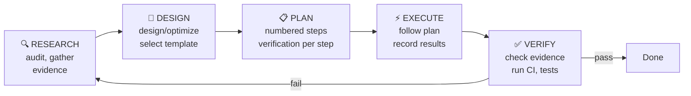

# task-orchestrator

**This is a meta-skill.** It controls HOW other tasks are executed, not WHAT they do. It must be loaded before any non-trivial work begins.

## Pipeline (mandatory for every atomic task)



### Phase 1: RESEARCH
- Audit current state: read relevant files, check CI logs, inspect git status
- Identify all stakeholders: which files, systems, or processes are affected
- Gather evidence: do NOT assume, do NOT guess, do NOT rely on memory
- Record findings in `.task-orchestrator/research-${task}.md`

### Phase 2: DESIGN
- Design the solution approach (or select from existing template)
- For known task types: load the subskill template from `skills/.task-orchestrator-templates/`
- For novel tasks: design from first principles
- If the model/agent suggests a BETTER approach than the template: flag it for template upgrade
- Record design decisions in `.task-orchestrator/design-${task}.md`

### Phase 3: PLAN
- Decompose into numbered, verifiable steps
- Each step must have: action, expected outcome, verification method
- If using a template: adapt the template steps to the specific context
- Use `update_plan` tool when available
- Record plan in `.task-orchestrator/plan-${task}.md`

### Phase 4: EXECUTE
- Follow the plan step by step
- Do NOT skip verification steps
- Do NOT claim completion without evidence
- Record completion status per step

### Phase 5: VERIFY
- For each step: confirm the expected outcome with evidence
- Run structural checks (validator, linter, test suite)
- Check CI status if applicable
- If verification fails: return to RESEARCH phase
- Record verification in `.task-orchestrator/verify-${task}.md`

## Model/Agent Capability Profiling

The orchestrator adapts its strictness based on detected capabilities:

| Profile | Agent | Model | Strategy |
|---|---|---|---|
| **High-capability** | Claude Code | Opus 4.6+, GPT-5+ | Templates are REFERENCE only. Agent can self-derive approach. Light audit at end. |
| **Medium-capability** | Codex | GPT-4, Claude 3.5 | Templates are GUIDELINES. Follow pipeline but allow adaptation. Full verify. |
| **Low-capability** | Codex | DeepSeek, Gemini, local | Templates are MANDATORY. Strict pipeline enforced. No deviation without explicit approval. Extra verification gates. |

### Model-tier sub-agent routing (token thrift, task 10)

Model tiers per agent are declared once in `adapters/models.config.json` (high/mid/small) and resolved by
`scripts/resolve_model.mjs`:

```
node scripts/resolve_model.mjs <agent> <tier|task-kind>            # e.g. claude research -> claude-opus-4-8
node scripts/resolve_model.mjs <agent> <tier|task-kind> --effort   # e.g. claude mid      -> max
```

Each tier also carries a reasoning **effort** (`adapters/models.config.json` → `effort`). The **`mid`** tier is
`claude-sonnet-5` at **max** effort — a strong Sonnet-5 run costs far less than Opus but, at max effort, holds
quality on implement/verify. So when you spawn a `mid` sub-agent, pass `model: claude-sonnet-5, effort: max`.

Use it to cut token cost WITHOUT losing quality on the hard steps:

- **Claude Code** cannot switch model mid-session, so run the MAIN loop on `high` and delegate the cheap,
  mechanical, or verify steps to SUB-AGENTS resolved to `mid`/`small` (e.g. `resolve_model.mjs claude verify`
  → `claude-sonnet-5` + `--effort` → `max`). Guard: only delegate when the sub-agent's token-in is less than
  the tokens saved by the smaller model — spawning a sub-agent that re-reads a huge context can cost MORE.
  Measure before defaulting.
- **opencode** switches natively; its `model`/`small_model` in `opencode.json` are generated from this same
  config, so the tiers already apply.
- **Codex** switches via external tooling (cc-switch / provider config). NEVER auto-configure provider
  switching for Claude Code (account-ban risk).

Map task-kinds → tiers via the config's `task_tier` (research/design → high, implement/verify → mid,
mechanical → small) so the RESEARCH→DESIGN→IMPLEMENT→VERIFY pipeline can pick a sensible model per stage.

### Capability detection

```bash
# The orchestrator detects capability from:
# 1. Environment variables: CODEX_MODEL, CLAUDE_MODEL
# 2. Config files: ~/.codex/config.toml, ~/.claude/settings.json
# 3. Self-assessment: ask model to rate its own capability on known benchmarks
```

## Subskill Plan Templates

Templates live in `skills/.task-orchestrator-templates/`. Each template is a subskill with frontmatter that records:

- `template-for`: what task type this covers
- `last-updated`: when the template was last improved
- `min-capability`: minimum model capability needed to skip this template
- `improvements-from`: which model/agent contributed improvements

### Available templates

Each is a directory under `skills/.task-orchestrator-templates/` containing a `SKILL.md`.

| Template | Task | Auto-selects when |
|---|---|---|
| `feature-audit/` | Audit existing features for gaps | task mentions "audit" or "check" or "verify all" |
| `workflow-fix/` | Fix CI/CD workflow failures | task mentions "fix workflow" or "fix CI" or "fix actions" |

For task types without a template, derive the plan from the RESEARCH→DESIGN→IMPLEMENT→VERIFY pipeline directly — do not reference a template that has no directory.

### Planned templates (NOT yet shipped — must NOT be auto-selected)

On the roadmap but no `SKILL.md` exists yet, so the orchestrator must not load or advertise them as available: `hook-add` (add a hook, Claude + Codex), `skill-create` (Claude source + Codex wrapper), `rename-project` (rename across all files), `dependency-update` (safe dependency upgrades). Add a directory + `SKILL.md` before wiring any of these in — otherwise it is a dead knob.

### Template self-improvement protocol

When any model/agent discovers a BETTER approach than the template:
1. Record the improvement in `.task-orchestrator/improvements/${task}-${date}.md`
2. Flag with `@template-upgrade` in the improvement record
3. The maintainer reviews flagged improvements periodically
4. Approved improvements are merged into the template
5. Template `last-updated` and `improvements-from` fields are updated

### Template version tracking

Each template has a version history in its frontmatter:

```yaml
template-version: 3
version-history:
  - version: 1
    date: 2026-07-01
    author: claude-code/opus-4.6
    changes: Initial template
  - version: 2
    date: 2026-07-05
    author: codex/deepseek-v3
    changes: Added OpenSSL fix, gitleaks allowlist step
  - version: 3
    date: 2026-07-08
    author: codex/gpt-5
    changes: Added pre-commit-ci.yml multi-workflow audit step
```

## Quickstart

### For any task

1. Load this skill: `/skills` → `task-orchestrator`
2. State your task. The orchestrator will:
   a. Detect model/agent capability
   b. Select appropriate template (if exists)
   c. Guide you through Research → Design → Plan → Execute → Verify
3. The orchestrator creates artifacts in `.task-orchestrator/`

### For maintainers adding new templates

```bash
# Use the new-skill meta-skill, selecting "task-orchestrator-template" type
/new-skill
# Answer: type=task-orchestrator-template, task=<describe what tasks this covers>
```

Template files go in `skills/.task-orchestrator-templates/<template-name>/SKILL.md`.

## Anti-patterns (what this skill prevents)

- "I'll just fix it" without checking CI logs → RESEARCH phase catches this
- "This looks right" without running verification → VERIFY phase catches this
- "I already fixed this" based on memory → evidence requirement catches this
- "The workflow should pass now" without checking CI → CI check in VERIFY catches this
- "All the other features are fine" without auditing → systematic audit template catches this

## Integration with code-verifier

When EXECUTE or VERIFY phases involve code quality claims, `code-verifier` is invoked automatically (via `allow_implicit_invocation`). The orchestrator does not replace code-verifier; it ensures code-verifier is called at the right time.

## Integration with review-gate

After all tasks complete and the session ends, `review-gate` fires automatically (via Stop hook). The orchestrator's `.task-orchestrator/` directory provides the review-gate with structured evidence of what was done and verified.
