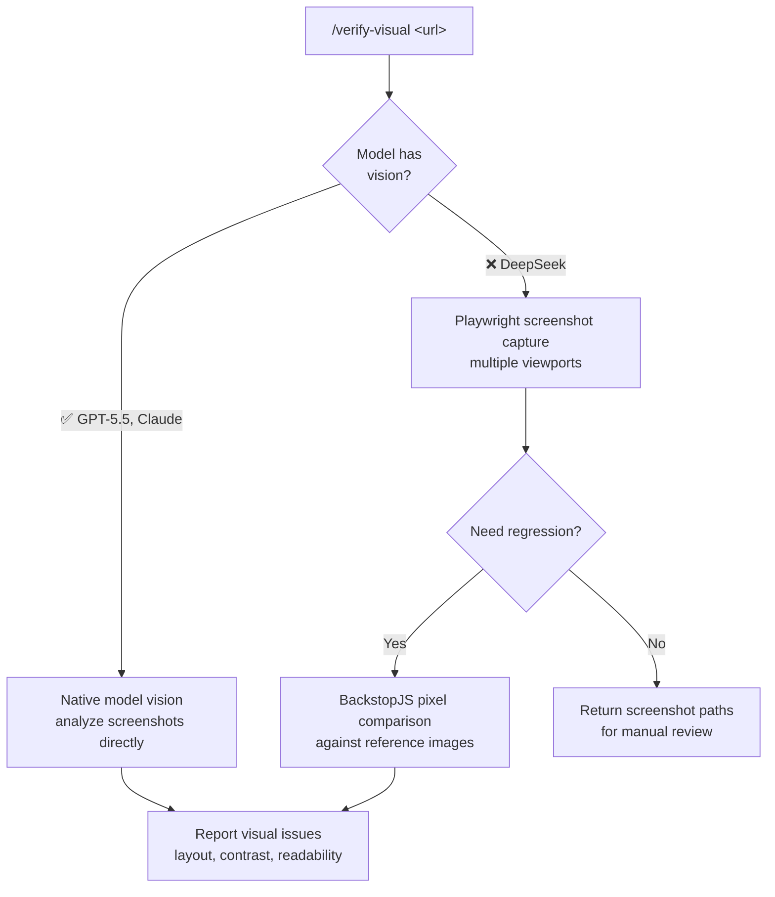

# verify-visual

## Detection: vision capability

| Model | Vision | Backend |
|---|---|---|
| GPT-5, GPT-5.5 | ✅ native | Model-based screenshot analysis |
| Claude Opus 4+ | ✅ native | Model-based + chrome-devtools MCP |
| DeepSeek V3, DeepSeek R1 | ❌ none | Playwright screenshot capture + pixel comparison |

## Backend 1: Native model vision (GPT-5.5, Claude)

When the model has vision capability, screenshots are captured and analyzed
directly by the model. No external API needed.

## Backend 2: Playwright screenshots (always available)

The `scripts/codex_visual_verify.sh` script captures screenshots at
specified viewports using Playwright or headless Chrome. Works with ANY model.

```bash
VISUAL_VERIFY_URL=https://localhost:3000 bash scripts/codex_visual_verify.sh
```

Output goes to `.visual-verify/YYYY-MM-DD_HHMMSS/` with a `results.json`.

## Backend 3: BackstopJS (pixel-level regression)

BackstopJS compares screenshots pixel-by-pixel against reference images.
No model needed. Good for CI regression testing.

```bash
npx backstopjs init
# Configure backstop.json then:
npx backstopjs test
```

## Workflow



## Configuration

Optional `~/.config/agent-harness/visual-verify.json`:

```json
{
  "viewports": ["1280x720", "375x812", "1920x1080"],
  "reference_dir": "./.visual-verify/reference"
}
```
